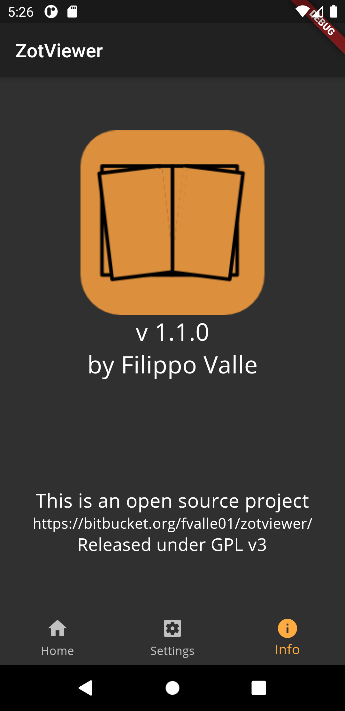

[](https://snapcraft.io/zotviewer)
# zotero_app

A new Flutter project to implement an app to interact with [Zotero](https://zotero.org).

[](https://play.google.com/store/apps/details?id=com.fvalle.zotero_app)
[](https://snapcraft.io/zotviewer/)

A [free testing version](https://play.google.com/apps/testing/com.fvalle.zotero_app) is also available.



## Compile

Download this project then use [Flutter](https://flutter.dev) to compile and run the application.

<!-- ### Web app

```
flutter run -d web-server --web-port=5555
```

Then point a browser to [localhost:5555](http://localhost:5555) -->

## API keys

To debug this app add in [lib/auth/api_credentials.dart](lib/auth/api_credentials.dart) Oauth1 API credential obtained from Zotero at [https://www.zotero.org/oauth/apps](https://www.zotero.org/oauth/apps)

In [authentication.dart](lib/auth/authentication.dart) change the following lines to use the correct file.
```dart
import 'package:zotero_app/auth/my_api_credentials.dart';
//import 'package:zotero_app/auth/api_credentials.dart'; // uncomment this and comment the above
```

# Screenshoot


# Play store

This app is [available on the Google Play Store](https://play.google.com/store/apps/details?id=com.fvalle.zotero_app)
