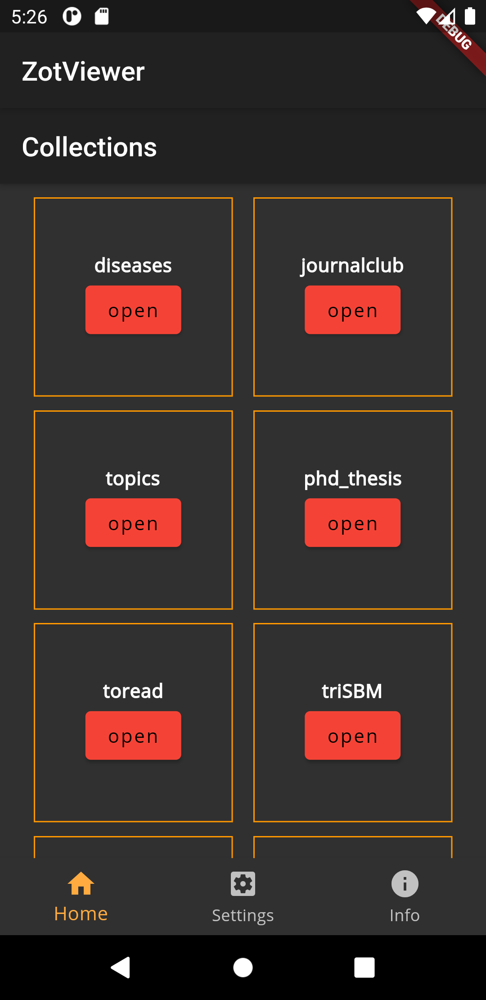

# zotero_app

A new Flutter project to implement an app to interact with [Zotero](https://zotero.org).


## Compile

Download this project then use [Flutter](https://flutter.dev) to compile and run the application.

<!-- ### Web app

```
flutter run -d web-server --web-port=5555
```

Then point a browser to [localhost:5555](http://localhost:5555) -->

## API keys

To debug this app add in [lib/auth/api_credentials.dart](lib/auth/api_credentials.dart) Oauth1 API credential obtained from Zotero at [https://www.zotero.org/oauth/apps](https://www.zotero.org/oauth/apps)

In [authentication.dart](lib/auth/authentication.dart) change the following lines to use the correct file.
```dart
import 'package:zotero_app/auth/my_api_credentials.dart';
//import 'package:zotero_app/auth/api_credentials.dart'; // uncomment this and comment the above
```

# Screenshoot




